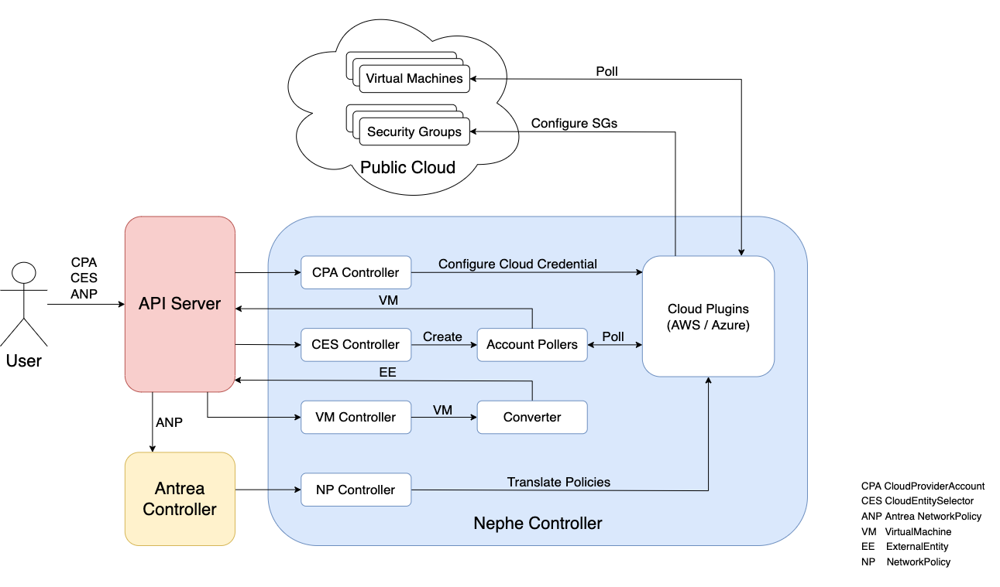

# Nephe Architecture

## Table of Contents

<!-- toc -->
- [Introduction](#introduction)
- [Components](#components)
  - [Cloud Provider Account (CPA) Controller](#cloud-provider-account-cpa-controller)
  - [Cloud Entity Selector (CES) Controller](#cloud-entity-selector-ces-controller)
  - [Account Poller](#account-poller)
  - [Virtual Machine (VM) Controller](#virtual-machine-vm-controller)
  - [Converter](#converter)
  - [Antrea Controller](#antrea-controller)
  - [NetworkPolicy (NP) Controller](#networkpolicy-np-controller)
  - [Cloud Plugins](#cloud-plugins)
<!-- /toc -->

## Introduction

Nephe supports micro-segmentation of Public Cloud Virtual Machines by
realizing [Antrea NetworkPolicies](https://github.com/antrea-io/antrea/blob/main/docs/antrea-network-policy.md)
on Virtual Machines. It leverages cloud network security groups to enforce
Antrea `NetworkPolicies`. Nephe supports enforcing policies on AWS and Azure
Cloud VMs. The support for Public Cloud platform is designed to be a pluggable
architecture, so that it can be extended to support other cloud platforms in the
future.

`Nephe Controller` imports Public Cloud VMs onto the Kubernetes cluster as
`VirtualMachine` CRs and then converts them into `ExternalEntity` CRs. The users
will use `ExternalEntity` CR to define custom Antrea `NetworkPolicies`. The
`Nephe Controller` translates these Antrea `NetworkPolicies` into cloud-native
network security groups and rules. These security groups are then
attached to Public Cloud VMs. The `Nephe Controller` is deployed as a Kubernetes
Deployment in the cluster.

## Components

The following diagram illustrates the `nephe-controller` components and the
relevant resources in a Kubernetes cluster.

### Cloud Provider Account (CPA) Controller

The CPA controller interfaces with the cloud providers APIs, and it is
responsible for management of cloud accounts. The CPA controller watches
`CloudProviderAccount` CR resources specified by the user, and sets up cloud
access in the cloud plugin. It extracts credentials from the CR and initializes
cloud sessions, which is then consumed by the account poller, network policy
controller etc.

### Cloud Entity Selector (CES) Controller

The CES controller watches `CloudEntitySelectors` CR specified by the user. It
extracts the specified `CloudProviderAccount` and the match selectors in the 
CR. It scans corresponding cloud providers' VPC / VNET, discovers matching
cloud resources such as VMs, and caches them. An account poller is configured by
the controller in the same Namespace as the `CloudEntitySelector`.

### Account Poller

Account poller is created for each configured `CloudEntitySelector` at the
Namespace level. On every polling interval, the account poller accesses
Cloud-Interface plugin routines and gets all cached cloud resources.
For each cloud resource, it creates a corresponding VirtualMachine CR and
imports them into the same Namespace as the `CloudEntitySelector`.
It compares the cloud resources stored in `etcd` against the cloud
resources fetched and identifies which cloud resources needs to be created,
updated, and deleted. Accordingly `etcd` is updated.

### Virtual Machine (VM) Controller

The Virtual Machine Controller watches `VirtualMachine` CR and forwards the
updated CR objects to the Converter module.

### Converter

The Converter receives `VirtualMachine` CRs from VM controller and converts them
into `ExternalEntity` CRs, which will be consumed by `Antrea Controller` and
`NP Controller`. Each `ExternalEntity` object has K8s Labels that match cloud
resource properties, such as Kind, Name, VPC/VNET, and tags. It may also contain
IP addresses of cloud resources when applicable.

### Antrea Controller

The `Antrea Controller` watches on the changes in Antrea `NetworkPolicy`, and
computes the scopes, computes the address groups, translates to appropriate
Antrea internal newtorkpolicy structs, and disperses them accordingly to Antrea
CNI agent or `Nephe Controller`. To support cloud use case, the
`antrea-controller` understands `ExternalEntity` CRD and `externalEntitySelector`
fields, and use them accordingly for ANP span computation and dispersion.

### NetworkPolicy (NP) Controller

The NP controller watches for the `NetworkPolicy` events from
`Antrea Controller`. `Antrea Controller` guarantees that any internal
networkpolicy object and the associated CRs are pushed to the NP controller, while
the NP controller guarantees that NetworkPolicies are applied to Public Cloud
VMs managed by the `Nephe Controller` instance. It will translate network
policies into one or more cloud security groups and rules. The NP controller
uses cloud plugins to attach the security groups to the cloud VMs.
For more information, please refer to [NetworkPolicy document](networkpolicy.md).

### Cloud Plugins

The cloud plugins are used by other components to access cloud resources. It
stores cloud account information configured by the CPA controller and initiates
cloud sessions. It is built with a [plugin model](design-cloud-plugin.md).
This enables extending the controller to support different clouds. Currently,
supported plugins include:

- AWS
- Azure
