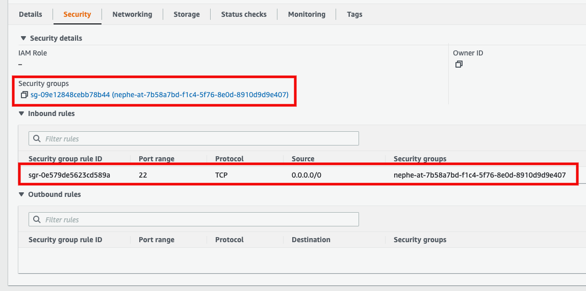

# Getting Started with Nephe

## Table of Contents

<!-- toc -->
- [Prerequisites](#prerequisites)
- [Nephe Installation](#nephe-installation)
  - [Deploying Nephe in a Kind cluster](#deploying-nephe-in-a-kind-cluster)
  - [Deploying Nephe in EKS cluster](#deploying-nephe-in-eks-cluster)
  - [Deploying Nephe in AKS cluster](#deploying-nephe-in-aks-cluster)
- [Importing Cloud VMs](#importing-cloud-vms)
  - [CloudProviderAccount](#cloudprovideraccount)
    - [Sample Secret for AWS](#sample-secret-for-aws)
    - [Sample CloudProviderAccount for AWS](#sample-cloudprovideraccount-for-aws)
    - [Sample Secret for Azure](#sample-secret-for-azure)
    - [Sample CloudProviderAccount for Azure](#sample-cloudprovideraccount-for-azure)
  - [CloudEntitySelector](#cloudentityselector)
  - [External Entity](#external-entity)
- [Applying Antrea NetworkPolicy](#applying-antrea-networkpolicy)
<!-- /toc -->

## Prerequisites

- [Kubectl](https://kubernetes.io/docs/tasks/tools/) installed.
- An active Kubernetes cluster, accessible using kubectl.
- [Antrea](https://github.com/antrea-io/antrea/) deployed. Recommend v1.10.
- [Cert-Manager](https://github.com/jetstack/cert-manager) deployed. Recommend
  v1.8.

## Nephe Installation

### Deploying Nephe in a Kind cluster

Create a Kind cluster. Recommend Kind v0.12.

```bash
./ci/kind/kind-setup.sh create kind
```

Install Nephe.

To deploy a released version of Nephe, pick a deployment manifest from the
[list of releases](https://github.com/antrea-io/nephe/releases). For any given
release <TAG> (e.g. v0.1.0), you can deploy Nephe as follows:

```bash
kubectl apply -f https://github.com/antrea-io/nephe/releases/download/<TAG>/nephe.yml
```

To deploy the latest version of Nephe (built from the main branch), use the
checked-in [deployment yaml](../config/nephe.yml):

```bash
kubectl apply -f https://raw.githubusercontent.com/antrea-io/nephe/main/config/nephe.yml
```

### Deploying Nephe in EKS cluster

To deploy Nephe on an EKS cluster, please refer
to [the EKS installation guide](eks-installation.md).

### Deploying Nephe in AKS cluster

To deploy Nephe on an AKS cluster, please refer
to [the AKS installation guide](aks-installation.md).

## Importing Cloud VMs

To manage security policies of Public Cloud VMs, we need to first import the
target VMs onto the `Nephe Controller`. The following section explains how to
set up access to public cloud account, select target VMs, and import VMs into
the K8s cluster as `VirtualMachine` CRs. The examples below import VMs into the
`sample-ns` Namespace.

### CloudProviderAccount

Before importing cloud VMs, we need to configure a `CloudProviderAccount` CR,
with a K8s Secret containing base64 encoded cloud account credentials. The
Secret should be created in `nephe-system` Namespace, so that `Nephe Controller`
can access it.

#### Sample Secret for AWS

To get the base64 encoded json string for credential, run:

```bash
echo '{"accessKeyId": "YOUR_AWS_ACCESS_KEY_ID", "accessKeySecret": "YOUR_AWS_ACCESS_KEY_SECRET", "roleArn": "YOUR_AWS_IAM_ROLE_ARN", "externalId": "IAM_ROLE_EXTERNAL_ID"}' | openssl base64 | tr -d '\n'
```

Note: `roleArn` and `externalId` are used for role based access on AWS, they can
be removed if credentials are provided.

```bash
cat <<EOF | kubectl apply -f -
apiVersion: v1
kind: Secret
metadata:
  name: aws-account-creds
  namespace: nephe-system
type: Opaque
data:
  credentials: "<BASE64_ENCODED_JSON_STRING>"
EOF
```

#### Sample CloudProviderAccount for AWS

```bash
kubectl create namespace sample-ns
cat <<EOF | kubectl apply -f -
apiVersion: crd.cloud.antrea.io/v1alpha1
kind: CloudProviderAccount
metadata:
  name: cloudprovideraccount-aws-sample
  namespace: sample-ns
spec:
  awsConfig:
    region: "<REPLACE_ME>"
    secretRef:
      name: aws-account-creds
      namespace: nephe-system
      key: credentials
EOF
```

#### Sample Secret for Azure

To get the base64 encoded json string for credential, run:

```bash
echo '{"subscriptionId": "YOUR_AZURE_SUBSCRIPTION_ID", "clientId": "YOUR_AZURE_CLIENT_ID", "tenantId": "YOUR_AZURE_TENANT_ID", "clientKey": "YOUR_AZURE_CLIENT_KEY"}' | openssl base64 | tr -d '\n'
```

```bash
cat <<EOF | kubectl apply -f -
apiVersion: v1
kind: Secret
metadata:
  name: azure-account-creds
  namespace: nephe-system
type: Opaque
data:
  credentials: "<BASE64_ENCODED_JSON_STRING>"
EOF
```

#### Sample CloudProviderAccount for Azure

```bash
kubectl create namespace sample-ns
cat <<EOF | kubectl apply -f -
apiVersion: crd.cloud.antrea.io/v1alpha1
kind: CloudProviderAccount
metadata:
  name: cloudprovideraccount-azure-sample
  namespace: sample-ns
spec:
  azureConfig:
    region: "<REPLACE_ME>"
    secretRef:
      name: azure-account-creds
      namespace: nephe-system
      key: credentials
EOF
```

### CloudEntitySelector

Once a `CloudProviderAccount` CR is added, virtual machines (VMs) may be
imported in the same Namespace via `CloudEntitySelector` CR. The below example
selects VMs in VPC `VPC_ID` from `cloudprovideraccount-sample` to import in
`sample-ns` Namespace.

```bash
cat <<EOF | kubectl apply -f -
apiVersion: crd.cloud.antrea.io/v1alpha1
kind: CloudEntitySelector
metadata:
  name: cloudentityselector-aws-sample
  namespace: sample-ns
spec:
  accountName: cloudprovideraccount-aws-sample
  vmSelector:
      - vpcMatch:
          matchID: "<VPC_ID>"
EOF
```

Also, after a `CloudProviderAccount` CR is added, VPCs are automatically polled
for the configured region. Invoke kubectl commands to get the details of imported VPCs.

```bash
kubectl get vpc -A
```

```text
# Output
NAMESPACE   NAME                    CLOUD PROVIDER   REGION      MANAGED
sample-ns   vpc-0d6bb6a4a880bd9ad   AWS              us-west-1   true
sample-ns   vpc-04269a331ab6cd649   AWS              us-west-1   false
sample-ns   vpc-047156bebab1083c9   AWS              us-west-1   false
```

Use describe on VPC object to get `Id` or `Name` field and use it in vpcMatch
section of `CloudEntitySelector` configuration.

```bash
kubectl describe vpc vpc-0d6bb6a4a880bd9ad -n sample-ns
```

```text
# Output
Name:         vpc-0d6bb6a4a880bd9ad
Namespace:    sample-ns
Labels:       account-name=cloudprovideraccount-aws-sample
              region=us-west-1
Annotations:  <none>
API Version:  runtime.cloud.antrea.io/v1alpha1
Kind:         Vpc
Metadata:
  Creation Timestamp:  <nil>
Spec:
  Cidrs:
    10.0.0.0/16
  Cloud Provider:  AWS
  Id:              vpc-0d6bb6a4a880bd9ad
  Name:            test-us-west1-vpc
  Region:          us-west-1
  Tags:
    Name:         test-us-west1-vpc
    Terraform:    true
Events:           <none>
```

If there are any virtual machines in VPC `VPC_ID`, those virtual machines will
be imported. Invoke kubectl commands to get the details of imported VMs.

```bash
kubectl get virtualmachines -A
kubectl get vm -A
```

```text
# Output
NAMESPACE        NAME                  CLOUD-PROVIDER   VIRTUAL-PRIVATE-CLOUD   STATE
sample-ns        i-0033eb4a6c846451d   AWS              vpc-0d6bb6a4a880bd9ad   running
sample-ns        i-05e3fb66922d56e0a   AWS              vpc-0d6bb6a4a880bd9ad   running
sample-ns        i-0a20bae92ddcdb60b   AWS              vpc-0d6bb6a4a880bd9ad   running
```

Currently, the following matching criteria are supported to import VMs.

- AWS:
  - vpcMatch: matchID, matchName
  - vmMatch: matchID, matchName
- Azure:
  - vpcMatch: matchID
  - vmMatch: matchID, matchName

### External Entity

For each cloud VM, an `ExternalEntity` CR is created, which can be used to
configure Antrea `NetworkPolicy` (ANP).

```bash
kubectl get externalentities -A
kubectl get ee -A
```

```text
# Output
NAMESPACE   NAME                                 AGE
sample-ns   virtualmachine-i-0033eb4a6c846451d   13m
sample-ns   virtualmachine-i-05e3fb66922d56e0a   13m
sample-ns   virtualmachine-i-0a20bae92ddcdb60b   13m
```

Issue kubectl command to get detailed information about the
ExternalEntity CR.

```bash
kubectl describe ee virtualmachine-i-0033eb4a6c846451d -n sample-ns
```

```text
# Output
Name:         virtualmachine-i-0033eb4a6c846451d
Namespace:    sample-ns
Labels:       environment.tag.nephe=nephe
              kind.nephe=virtualmachine
              login.tag.nephe=ubuntu
              name.nephe=i-0033eb4a6c846451d
              name.tag.nephe=vpc-0d6bb6a4a880bd9ad-ubuntu1
              namespace.nephe=sample-ns
              terraform.tag.nephe=true
              vpc.nephe=vpc-0d6bb6a4a880bd9ad
Annotations:  <none>
API Version:  crd.antrea.io/v1alpha2
Kind:         ExternalEntity
Metadata:
  Creation Timestamp:  2022-08-21T12:27:16Z
  Generation:          1
  Managed Fields:
    API Version:  crd.antrea.io/v1alpha2
    Fields Type:  FieldsV1
    fieldsV1:
      f:metadata:
        f:labels:
          .:
          f:environment.tag.nephe:
          f:kind.nephe:
          f:login.tag.nephe:
          f:name.nephe:
          f:name.tag.nephe:
          f:namespace.nephe:
          f:terraform.tag.nephe:
          f:vpc.nephe:
        f:ownerReferences:
          .:
          k:{"uid":"aff897e4-5e4d-4f88-8a7c-d48f18d41bf7"}:
      f:spec:
        .:
        f:endpoints:
        f:externalNode:
    Manager:    nephe-controller
    Operation:  Update
    Time:       2022-08-21T12:27:16Z
  Owner References:
    API Version:           crd.cloud.antrea.io/v1alpha1
    Block Owner Deletion:  true
    Controller:            true
    Kind:                  VirtualMachine
    Name:                  i-0033eb4a6c846451d
    UID:                   aff897e4-5e4d-4f88-8a7c-d48f18d41bf7
  Resource Version:        478254
  UID:                     bf01e92f-095a-48d2-8b3b-482e2084a135
Spec:
  Endpoints:
    Ip:           10.0.1.173
    Ip:           54.177.32.161
  External Node:  nephe-controller
Events:           <none>
```

## Applying Antrea NetworkPolicy

With the VMs imported into the cluster, we can now configure their security
policies by setting and applying [Antrea NetworkPolicies (ANP)](https://github.com/antrea-io/antrea/blob/main/docs/antrea-network-policy.md)
on them. The policy will be realized with cloud network security groups and
rules. Please refer to [NetworkPolicy](networkpolicy.md) documentation for
more information on how ANPs are used, translated, and applied.

Cloud VirtualMachine CRs may be selected in `externalEntitySelectors` under
`To`, `From` and  `AppliedTo` fields of Antrea `NetworkPolicy`.

The below sample ANP allows ssh traffic to all VMs.

```bash
cat <<EOF | kubectl apply -f -
apiVersion: crd.antrea.io/v1alpha1
kind: NetworkPolicy
metadata:
  name: vm-anp
  namespace: sample-ns
spec:
  appliedTo:
  - externalEntitySelector:
      matchLabels:
         kind.nephe: virtualmachine
  ingress:
  - action: Allow
    from:
      - ipBlock:
          cidr: 0.0.0.0/0
    ports:
      - protocol: TCP
        port: 22

EOF
```

Below shows the security groups on the AWS EC2 console after the above network
policy is applied.



The VirtualMachinePolicy (VMP) API will display the policy realization status of
all the policies applied to a VM. The ANP status on a virtual machine will be
shown in the `Realization` field. In the below example, `vm-anp` is successfully
applied to all VMs.

```bash
kubectl get virtualmachinepolicy -A
kubectl get vmp -A
```

```text
# Output
NAMESPACE   VM NAME               REALIZATION   COUNT
sample-ns   i-05e3fb66922d56e0a   SUCCESS       1
sample-ns   i-0a20bae92ddcdb60b   SUCCESS       1
sample-ns   i-0033eb4a6c846451d   SUCCESS       1
```

The `externalEntitySelector` field in ANP supports the following pre-defined
labels:

- `kind.nephe`: Select based on CRD type. Currently, only supported
  CRD type is `virtualmachine` in lower case. `virtualmachine` may be used in
  `To`, `From`, `AppliedTo` ANP fields. Thus, an ANP may be applied to virtual
  machines.
- `vpc.nephe`: Select based on cloud resource VPC.
- `name.nephe`: Select based on K8s resource name. The resource name
  is meaningful only within the K8s cluster. For AWS, virtual machine name is
  the AWS VM instance ID. For Azure virtual machine name is the hashed values of
  the Azure VM resource ID.
- `key.tag.nephe`: Select based on cloud resource tag key/value pair,
  where `key` is the cloud resource `Key` tag (in lower case) and the `label`
  value is cloud resource tag `Value` in lower case.
