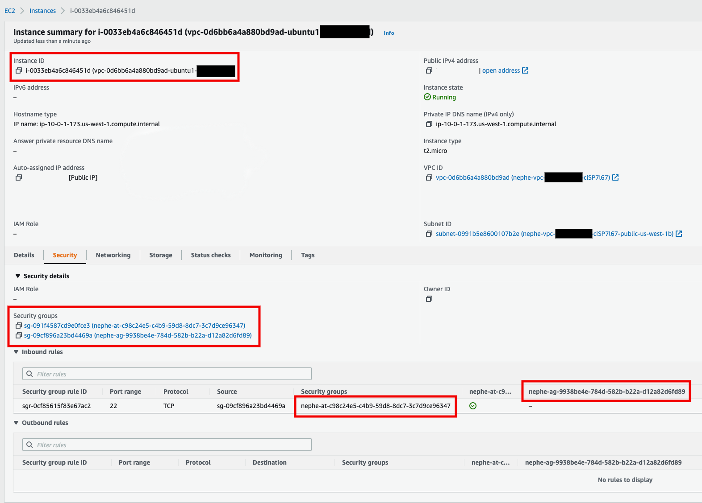
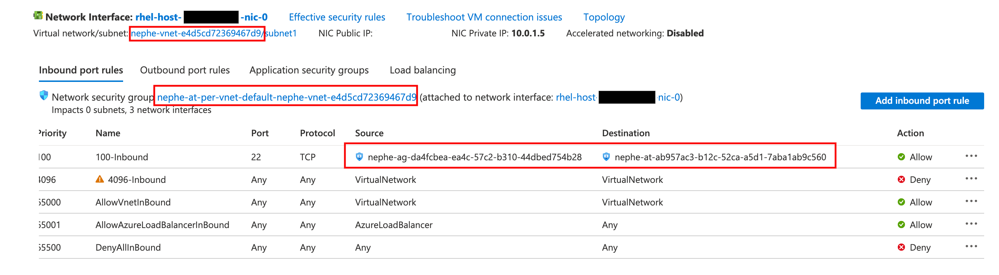
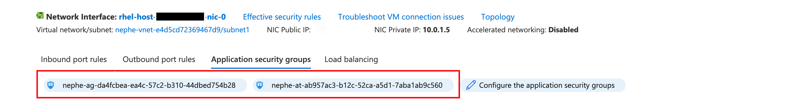

# Nephe NetworkPolicy

## Table of Contents

<!-- toc -->
- [Introduction](#introduction)
- [Basic Concepts](#basic-concepts)
  - [Antrea Internal NetworkPolicy](#antrea-internal-networkpolicy)
  - [Cloud Network Security Group](#cloud-network-security-group)
- [Implementation](#implementation)
  - [AddressGroup NSG](#addressgroup-nsg)
  - [AppliedTo NSG](#appliedto-nsg)
  - [Mapping Antrea NetworkPolicy To NSG](#mapping-antrea-networkpolicy-to-nsg)
  - [ANP Rule realization](#anp-rule-realization)
- [AWS Example](#aws-example)
  - [List Virtual Machines](#list-virtual-machines)
  - [List External Entities](#list-external-entities)
  - [Create a sample Antrea NetworkPolicy](#create-a-sample-antrea-networkpolicy)
  - [Mapping Antrea NetworkPolicy To NSG](#mapping-antrea-networkpolicy-to-nsg-1)
  - [AddressGroup NSG](#addressgroup-nsg-1)
  - [AppliedToGroup NSG](#appliedtogroup-nsg)
  - [Verify ANP Rule realization on VM](#verify-anp-rule-realization-on-vm)
- [Azure Example](#azure-example)
  - [List Virtual Machines](#list-virtual-machines-1)
  - [List External Entities](#list-external-entities-1)
  - [Create a sample Antrea NetworkPolicy](#create-a-sample-antrea-networkpolicy-1)
  - [Mapping Antrea NetworkPolicy To NSG](#mapping-antrea-networkpolicy-to-nsg-2)
  - [AddressGroup ASG](#addressgroup-asg)
  - [AppliedTo ASG](#appliedto-asg)
  - [Verify ANP Rule realization on VM](#verify-anp-rule-realization-on-vm-1)
<!-- /toc -->

## Introduction

The Nephe project does not consume the Antrea `NetworkPolicy`(ANP) CR directly.
The ANP CR is used by [Antrea](https://antrea.io/) project, where
`antrea-controller` pod watches for the Antrea `NetworkPolicy` CR and
converts each ANP CR to an Antrea internal [NetworkPolicy](https://github.com/antrea-io/antrea/blob/main/pkg/apis/controlplane/v1beta2/types.go#L202)
object for further processing. This Antrea internal NetworkPolicy object
will be used by the `Nephe Controller` to enforce the network policies on Public
Cloud Virtual Machines.

`Nephe Controller` registers with the antrea `API server`, to receive all
the events related to `AddressGroups`, `AppliedToGroups` and
`NetworkPolicies` objects. `Nephe Controller` translates these
NetworkPolicy related objects to the corresponding cloud constructs. Each antrea
internal NetworkPolicy object will result in a combination of one
or more cloud network security groups. The `AddressGroups` field will be
translated to a cloud NSG, and it will be embedded in `source/destination` field
of a cloud network security rule. The `AppliedToGroups` will translated to a
NSG, and it will be attached to the public cloud VMs. Currently, enforcing ANP
is only supported on AWS and Azure clouds.

## Basic Concepts

This section gives a brief introduction about Antrea internal NetworkPolicy
object and cloud network security groups. These two concepts are the basics to
understand how `nephe-controller` realizes network polices on Public Cloud
VMs. If you are already familiar with these two concepts, please skip this
section and proceed to the [Implementation](#implementation) section.

### Antrea Internal NetworkPolicy

Each Antrea internal NetworkPolicy object contains a `Name` and `Namespace`
field that uniquely identifies an Antrea internal NetworkPolicy object. 
`Name` and `Namespace` corresponds to user facing Antrea `NetworkPolicy`(ANP).
It contains list of rules and a list of references to the appliedToGroups and
addressGroups.

Each `Rule` contains:
- A direction field.
- A list of services (port).
- To/From field - IPBlock and reference to a list `AddressGroups`.

An `AddressGroup` is used in `To/From` field of an ANP Rule. Each 
`AddressGroup` contains the following:
- An auto-generated name, which uniquely identifies an `AdressGroup`.
- A list of GroupMembers, each may contain references of ExternalEntities if
  applicable.
- A list of Endpoint, each contains IP address and ports.

An `AppliedToGroup` is used in `AppliedTo` field of an ANP. Each `AppliedToGroup`
contains the following:
- An auto-generated name (namespace-less) uniquely identifies a `AppliedToGroup`.
- A list of GroupMembers, each may contain references of ExternalEntities if
  applicable.
- A list of Endpoints, each contains IP address and ports.

### Cloud Network Security Group

Cloud Network Security Group (NSG) is a whitelist, which is at a VPC/VNET level.
It is uniquely identified by its Name or an ID. It contains zero or more Network
Interface Cards (NIC). A NIC may be associated with zero or more NSGs. A NSG
contains Ingress and Egress rules.

**An Ingress Rule includes**:
- IPBlocks - a list of source IP blocks of the permitted incoming traffic.
- Ports - a list of source ports of the permitted incoming traffic.
- SecurityGroups - a list of securityGroups from which incoming traffic is
  permitted.

**An Egress Rule includes**:
- IPBlocks - a list of destination IP blocks of the permitted outgoing traffic.
- Ports - a list of destination ports of the permitted outgoing traffic.
- SecurityGroups - a list of securityGroups to which outgoing traffic is
  permitted.

## Implementation 

The `Nephe Controller` creates two types of network security groups (NSGs) to
enforce network polices on public cloud VMs, which are called as
`AddressGroup NSG` and `AppliedTo NSG`. An Antrea internal NetworkPolicy is
realized on the cloud VMs via a combination of `AddressGroup NSG` and
`AppliedTo NSG`. For better performance/scalability, all cloud calls to manage
Nephe created NSGs are designed to be asynchronous.

### AddressGroup NSG 

AddressGroup NSG internally is referred to as cloud membership only security
group, as it contains only the GroupMembers. This type of NSG is created with a
prefix `nephe-ag-<adressGroupName>`, where the prefix `ag-` implies it is just
an `AddressGroup` based NSG. 

- Each Antrea AddressGroup is mapped to zero or more cloud membership only
`AddressGroup NSG`, and zero or more IP blocks. 
- Each `AddressGroup NSG` scope is at a VPC level, and which will not have
any ingress/egress rules.

### AppliedTo NSG

AppliedTo NSG will be applied to the Public Cloud VMs. This type of NSG is
created with a prefix `nephe-at-<appliedToGroupName>`, where the prefix `at-`
implies it is an `AppliedTo` based NSG.

- Each Antrea AppliedGroup is mapped to zero or more cloud `AppliedTo NSG`
- Each `AppliedTo NSG` scope is at a VPC level, and which will have ingress/egress
  rules associated with it.

### Mapping Antrea NetworkPolicy To NSG

Each `AddressGroup NSG` and IPBlocks uniquely maps `To/From` fields in the user
configured Antrea `NetworkPolicy`. Each `AppliedTo NSG` uniquely maps to an
`AppliedTo` field in the Antrea `NetworkPolicy`. Each `AppliedTo NSG` creates
ingress and egress rules based on cloud membership only `AddressGroup NSG` or
IPBlocks associated with an Antrea `NetworkPolicy`.

### ANP Rule realization

It is desirable to show what Antrea `NetworkPolicies` are associated with a
specific cloud resource and the Antrea `NetworkPolicies` realization status.
Each cloud resource shall keep track of cloud `AppliedTo NSG` it is associated
with. An Antrea `NetworkPolicy` is considered to be successfully applied to
a network resource, when the following expectations are met.
- Its `AppliedTo NSG` to which the network resource is a member of,
  are created/updated with no error.
- Its `AddressGroup NSG` are created/updated with no error.

## AWS Example

In this example, AWS cloud is configured using CloudProviderAccount (CPA) and
the cloud resource filter is configured using CloudEntitySelector (CES) to
import 3 VMs that belong to vpc `vpc-0d6bb6a4a880bd9ad`.

### List Virtual Machines

The following kubectl command can be used to retrieve VirtualMachine resources
that are imported:

```bash
kubectl get virtualmachines -A
kubectl get vm -A
```

```text
# Output
NAMESPACE   NAME                  CLOUD-PROVIDER   VIRTUAL-PRIVATE-CLOUD   STATE
aws-ns      i-0033eb4a6c846451d   AWS              vpc-0d6bb6a4a880bd9ad   running
aws-ns      i-05e3fb66922d56e0a   AWS              vpc-0d6bb6a4a880bd9ad   running
aws-ns      i-0a20bae92ddcdb60b   AWS              vpc-0d6bb6a4a880bd9ad   running
```

### List External Entities

The following kubectl command can be used to retrieve ExternalEntity resources
corresponding to each VM:

```bash
kubectl get externalentities -A
kubectl get ee -A
```

```text
# Output
NAMESPACE   NAME                                 AGE
aws-ns      virtualmachine-i-0033eb4a6c846451d   58m
aws-ns      virtualmachine-i-05e3fb66922d56e0a   58m
aws-ns      virtualmachine-i-0a20bae92ddcdb60b   58m
```

### Create a sample Antrea NetworkPolicy

A sample Antrea `NetworkPolicy` is shown below, which specifies an Ingress rule
allowing TCP traffic on port 22. The `from` field is an `externalEntitySelector`
with matching labels as `name.nephe: i-0033eb4a6c846451d`.  And the `appliedTo`
field is an `externalEntitySelector` with a matching label as
`kind.nephe: virtualmachine`.

```bash
# Add Policy to Allow SSH
apiVersion: crd.antrea.io/v1alpha1
kind: NetworkPolicy
metadata:
  name: allow-ssh
  namespace: aws-ns
spec:
  priority: 1
  appliedTo:
  - externalEntitySelector:
      matchLabels:
        kind.nephe: virtualmachine
  ingress:
  - action: Allow
    from:
    - externalEntitySelector:
        matchLabels:
          name.nephe: i-0033eb4a6c846451d
    ports:
    - protocol: TCP
      port: 22
```

### Mapping Antrea NetworkPolicy To NSG

`Nephe Controller` converts the sample ANP into a combination of
`AddressGroup NSG` and `AppliedTo NSG` and attaches the NSGs to the respective
VMs, as shown in the below image.



### AddressGroup NSG

The AddressGroup `9938be4e-784d-582b-b22a-d12a82d6fd89` corresponds to the 
`from` field of ANP. This group contains only one ExternalEntity as the Group
Members. `Nephe Controller` will convert this AddressGroup into an
`AddressGroup NSG` with NSG name as
`nephe-ag-9938be4e-784d-582b-b22a-d12a82d6fd89`.

```bash
kubectl describe addressgroups 9938be4e-784d-582b-b22a-d12a82d6fd89
```

```text
# Output
Name:         9938be4e-784d-582b-b22a-d12a82d6fd89
Namespace:    
Labels:       <none>
Annotations:  <none>
API Version:  controlplane.antrea.io/v1beta2
Group Members:
  External Entity:
    Name:       virtualmachine-i-0033eb4a6c846451d
    Namespace:  aws-ns
  Ips:
    AAAAAAAAAAAAAP//CgABrQ==
    AAAAAAAAAAAAAP//NrEgoQ==
Kind:  AddressGroup
Metadata:
  Creation Timestamp:  <nil>
  UID:                 9938be4e-784d-582b-b22a-d12a82d6fd89
Events:                <none>
```

### AppliedToGroup NSG

The AppliedToGroup `c98c24e5-c4b9-59d8-8dc7-3c7d9ce96347` corresponds to the
`appliedTo` field of the ANP. This group contains all the 3 ExternalEntities as
the Group Members. `Nephe Controller` will convert this AppliedToGroup into
an `AppliedTo NSG` with NSG name as
`nephe-at-c98c24e5-c4b9-59d8-8dc7-3c7d9ce96347` and it will attach this
NSG to all the 3 VMs.

```bash
kubectl describe appliedtogroups c98c24e5-c4b9-59d8-8dc7-3c7d9ce96347
```

```text
# Output
Name:         c98c24e5-c4b9-59d8-8dc7-3c7d9ce96347
Namespace:    
Labels:       <none>
Annotations:  <none>
API Version:  controlplane.antrea.io/v1beta2
Group Members:
  External Entity:
    Name:       virtualmachine-i-0a20bae92ddcdb60b
    Namespace:  aws-ns
  Ips:
    AAAAAAAAAAAAAP//CgABwg==
    AAAAAAAAAAAAAP//NpddTg==
  External Entity:
    Name:       virtualmachine-i-0033eb4a6c846451d
    Namespace:  aws-ns
  Ips:
    AAAAAAAAAAAAAP//CgABrQ==
    AAAAAAAAAAAAAP//NrEgoQ==
  External Entity:
    Name:       virtualmachine-i-05e3fb66922d56e0a
    Namespace:  aws-ns
  Ips:
    AAAAAAAAAAAAAP//CgABnw==
    AAAAAAAAAAAAAP//MhLhOg==
Kind:  AppliedToGroup
Metadata:
  Creation Timestamp:  <nil>
  UID:                 c98c24e5-c4b9-59d8-8dc7-3c7d9ce96347
Events:                <none>
```

### Verify ANP Rule realization on VM

The following kubectl command can be used to retrieve VirtualMachinePolicy
resources, which shows the ANP rules realization on each VM.

```bash
kubectl get vmp -A
kubectl get virtualmachinepolicy -A
```

```text
# Output
NAMESPACE   VM NAME               REALIZATION   COUNT
aws-ns      i-0a20bae92ddcdb60b   SUCCESS       1
aws-ns      i-0033eb4a6c846451d   SUCCESS       1
aws-ns      i-05e3fb66922d56e0a   SUCCESS       1
```

## Azure Example

In this example, Azure cloud is configured using CloudProviderAccount (CPA) and
the cloud resource filter is configured using CloudEntitySelector (CES) to
import 3 VMs that belong to vnet `nephe-vnet-e4d5cd72369467d9`.

### List Virtual Machines

The following kubectl command can be used to retrieve VirtualMachine resources
that are imported:

```bash
kubectl get virtualmachines -A
kubectl get vm -A
```

```text
# Output
NAMESPACE   NAME                          CLOUD-PROVIDER   VIRTUAL-PRIVATE-CLOUD        STATE
azure-ns    centos-host-vmlinux-0-16117   Azure            nephe-vnet-e4d5cd72369467d9  running
azure-ns    rhel-host-vmlinux-0-15892     Azure            nephe-vnet-e4d5cd72369467d9  running
azure-ns    ubuntu-host-vmlinux-0-16140   Azure            nephe-vnet-e4d5cd72369467d9  running
```

### List External Entities

The following kubectl command can be used to retrieve ExternalEntity resources
corresponding to each VM:

```bash
kubectl get externalentities -A
kubectl get ee -A
```

```text
# Output
NAMESPACE   NAME                                         AGE
azure-ns    virtualmachine-centos-host-vmlinux-0-16117   3m59s
azure-ns    virtualmachine-rhel-host-vmlinux-0-15892     3m59s
azure-ns    virtualmachine-ubuntu-host-vmlinux-0-16140   3m59s
```

### Create a sample Antrea NetworkPolicy

A sample Antrea `NetworkPolicy` is shown below, which specifies an Ingress rule
allowing TCP traffic on port 22. The `from` field is an externalEntitySelector
with matching labels as `name.nephe: rhel-host-vmlinux-0-15892`.
And the `appliedTo` field is an externalEntitySelector with a matching
label as `kind.nephe: virtualmachine`.

```bash
apiVersion: crd.antrea.io/v1alpha1
kind: NetworkPolicy
metadata:
  name: allow-ssh
  namespace: azure-ns
spec:
  priority: 1
  appliedTo:
  - externalEntitySelector:
      matchLabels:
        kind.nephe: virtualmachine
  ingress:
  - action: Allow
    from:
    - externalEntitySelector:
        matchLabels:
          name.nephe: rhel-host-vmlinux-0-15892
    ports:
    - protocol: TCP
      port: 22
```

### Mapping Antrea NetworkPolicy To NSG

In Azure each network interface is a member of only one network security group,
but a network interface can be a member of multiple application security
group (ASG). `Nephe Controller` converts the sample ANP into a combination of
`AddressGroup ASG` and `AppliedTo ASG`. These ASGs are then associated with
respective network interface of the VMs as shown in the below image.





### AddressGroup ASG

The AddressGroup `da4fcbea-ea4c-57c2-b310-44dbed754b28` corresponds to the
`from` field of ANP. This group contains only one ExternalEntity as the Group
Members. `Nephe Controller` will convert this AddressGroup into an
`AddressGroup ASG` with ASG name as
`nephe-ag-da4fcbea-ea4c-57c2-b310-44dbed754b28`.

```bash
kubectl describe addressgroups da4fcbea-ea4c-57c2-b310-44dbed754b28
```

```text
# Output
Name:         da4fcbea-ea4c-57c2-b310-44dbed754b28
Namespace:    
Labels:       <none>
Annotations:  <none>
API Version:  controlplane.antrea.io/v1beta2
Group Members:
  External Entity:
    Name:       virtualmachine-rhel-host-vmlinux-0-15892
    Namespace:  azure-ns
  Ips:
    AAAAAAAAAAAAAP//CgABBQ==
    AAAAAAAAAAAAAP//FGJH4g==
Kind:  AddressGroup
Metadata:
  Creation Timestamp:  <nil>
  UID:                 da4fcbea-ea4c-57c2-b310-44dbed754b28
Events:                <none>
```

### AppliedTo ASG

The AppliedToGroup `ab957ac3-b12c-52ca-a5d1-7aba1ab9c560` corresponds to the
`appliedTo` field of the ANP. This group contains all the 3 ExternalEntities as
the Group Members. `Nephe Controller` will convert this AppliedToGroup into
an `AppliedTo ASG` with ASG name as
`nephe-at-ab957ac3-b12c-52ca-a5d1-7aba1ab9c560` and it will attach this
ASG to all the 3 VMs

```bash
kubectl describe appliedtogroups ab957ac3-b12c-52ca-a5d1-7aba1ab9c560
```

```text
# Output
Name:         ab957ac3-b12c-52ca-a5d1-7aba1ab9c560
Namespace:    
Labels:       <none>
Annotations:  <none>
API Version:  controlplane.antrea.io/v1beta2
Group Members:
  External Entity:
    Name:       virtualmachine-ubuntu-host-vmlinux-0-16140
    Namespace:  azure-ns
  Ips:
    AAAAAAAAAAAAAP//CgABBA==
    AAAAAAAAAAAAAP//FGJH1w==
  External Entity:
    Name:       virtualmachine-centos-host-vmlinux-0-16117
    Namespace:  azure-ns
  Ips:
    AAAAAAAAAAAAAP//CgABBg==
    AAAAAAAAAAAAAP//FGJHcg==
  External Entity:
    Name:       virtualmachine-rhel-host-vmlinux-0-15892
    Namespace:  azure-ns
  Ips:
    AAAAAAAAAAAAAP//CgABBQ==
    AAAAAAAAAAAAAP//FGJH4g==
Kind:  AppliedToGroup
Metadata:
  Creation Timestamp:  <nil>
  UID:                 ab957ac3-b12c-52ca-a5d1-7aba1ab9c560
Events:                <none>
```

### Verify ANP Rule realization on VM

The following kubectl command can be used to retrieve VirtualMachinePolicy
resources, which shows the ANP rules realization on each VM.

```bash
kubectl get vmp -A
kubectl get virtualmachinepolicy -A
```

```text
# Output
NAMESPACE   VM NAME                       REALIZATION   COUNT
azure-ns    ubuntu-host-vmlinux-0-16140   SUCCESS       1
azure-ns    centos-host-vmlinux-0-16117   SUCCESS       1
azure-ns    rhel-host-vmlinux-0-15892     SUCCESS       1
```
